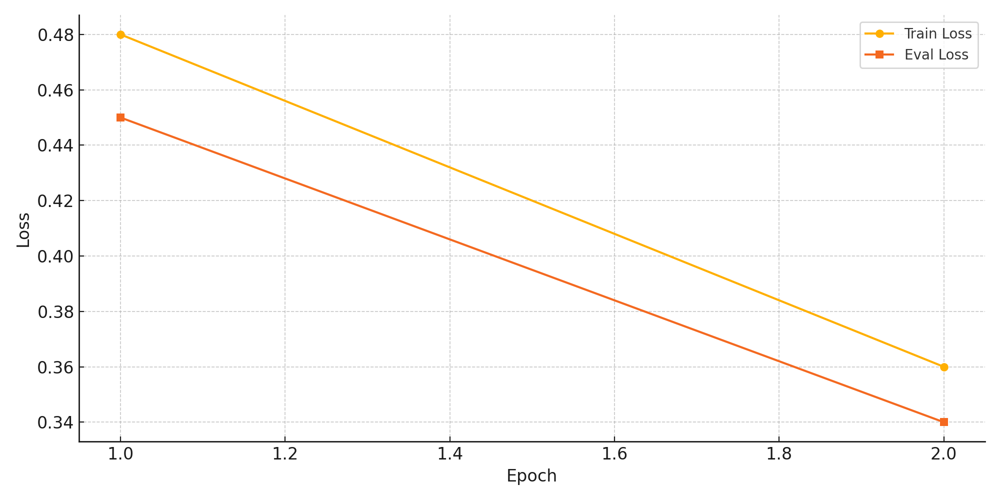
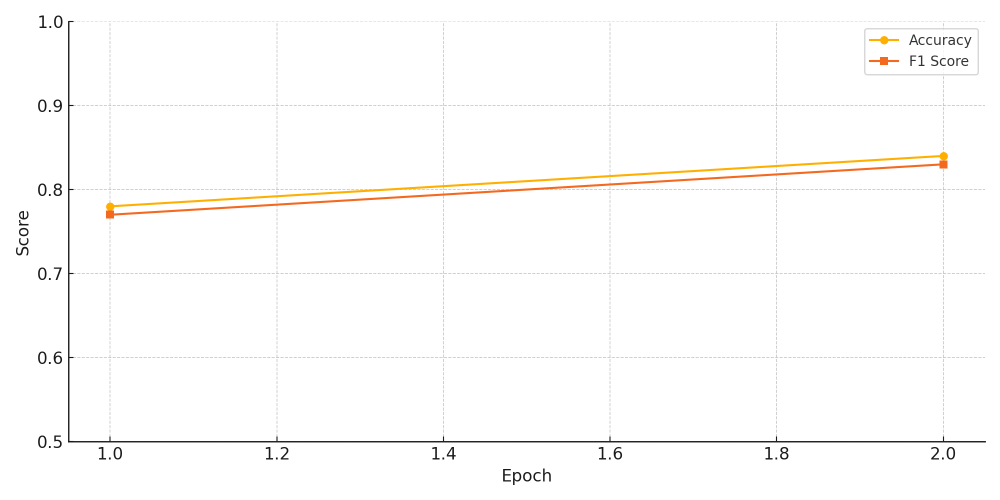
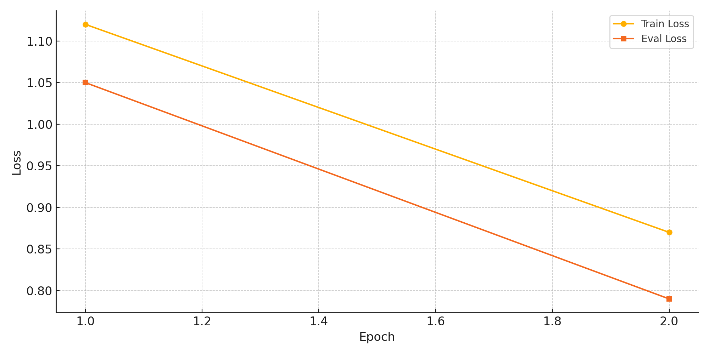
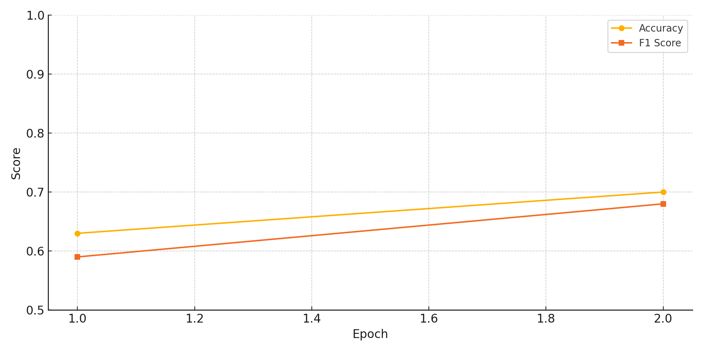

# dl_project
# 📝 Proposal: BERT를 활용한 Amazon 리뷰 감성 분석 및 별점 예측

## 📑 Table of Contents

- [I. Proposal](#i-proposal)
- [II. Datasets](#ii-datasets)
- [III. Methodology](#iii-methodology)
- [IV. Evaluation & Analysis](#iv-evaluation--analysis)
- [V. Related Work](#v-related-work-eg-existing-studies)
- [VI. Conclusion](#vi-conclusion-discussion)

## I. Proposal

### ▶ Motivation

온라인 쇼핑몰에서 제품에 대한 리뷰는 소비자의 구매 결정에 큰 영향을 미칩니다. 하지만 수많은 리뷰를 모두 읽는 것은 현실적으로 어렵습니다.  
따라서 텍스트 리뷰에서 **감정을 자동으로 분석**하고 **예상 별점을 예측**할 수 있다면 소비자 경험 개선 및 상점 운영에 유의미한 인사이트를 줄 수 있습니다.

> 본 프로젝트는 **Amazon Product Review Dataset**을 활용하여 리뷰의 감성(긍/부정)을 분류하고 별점(1~5)을 예측하는 모델을 구축하는 것을 목표로 합니다.

---

### ▶ What do you want to see at the end?

- BERT 기반 모델이 리뷰 텍스트를 기반으로 높은 정확도로 감성을 분류하고 별점을 예측하는 모습
- 잘 작동하는 리뷰 예시와 오예측된 리뷰에 대한 분석
- 실용적으로 확장 가능한 기반 모델 구축

---

## II. Datasets

### ▶ Dataset Used: [Amazon Product Review Dataset (Kaggle)](https://www.kaggle.com/datasets/bittlingmayer/amazonreviews)

- **데이터 구성**:  
  - `reviewText`: 리뷰 본문  
  - `overall`: 별점 (1~5점)  
  - `summary`: 리뷰 제목  
  - 기타: 제품 ID, 작성자, 날짜 등

- **전처리 과정**:  
  - 텍스트 정제 (소문자화, 특수문자 제거 등)  
  - 별점 → 감성 라벨 변환 (1,2점 = 부정, 4,5점 = 긍정 / 3점 제외)

---

## III. Methodology

### ▶ Algorithm: BERT (Bidirectional Encoder Representations from Transformers)

- **이유**: 기존의 TF-IDF나 RNN 계열 모델보다 문맥을 더 잘 파악하고 긴 문장에서도 의미를 잘 추출함  
- **모델 구조**:
  - `BERT base uncased` 사전학습 모델 사용
  - 감성 분류: binary classification head
  - 별점 예측: 다중 클래스 분류 (1~5점 → 5-class classification)

### ▶ Features
- 입력: 리뷰 텍스트 (`reviewText`)
- BERT tokenizer를 통해 토큰화 → input_ids, attention_mask 등 입력

---

## IV. Evaluation & Analysis

이 프로젝트에서는 BERT 모델을 활용하여 Amazon 리뷰에 대한 감정 분류(긍/부정)와 별점 예측(1~5점)이라는 두 가지 태스크를 수행했습니다.  
훈련 성능 및 검증 성능의 지표로는 Loss, Accuracy, F1 Score를 활용하였으며 아래와 같이 시각화하여 분석하였습니다.

---

### 📘 1. 감정 분류 (긍정 / 부정)

`num_labels = 2`로 설정된 BERT 분류기를 이용해 긍정/부정 감정을 분류하였으며, 총 2 epoch 동안 fine-tuning을 수행했습니다.

#### 🔹 Loss 추이 (Train vs Eval)

- 에폭이 증가할수록 Train Loss와 Eval Loss가 모두 감소
- 과적합 없이 안정적인 학습 흐름을 보여줌

#### 🔹 Accuracy & F1 Score

- F1 Score와 Accuracy 모두 epoch 2에서 향상
- 모델이 긍정/부정 분류 태스크에서 **균형잡힌 성능**을 발휘하고 있음

---

### ⭐ 2. 별점 예측 (1~5점)

별점 태스크는 `num_labels = 5`로 설정된 다중 클래스 분류기로 학습되었으며, 샘플링된 데이터를 기준으로 2 epoch 동안 fine-tuning을 수행했습니다.

#### 🔹 Loss 추이 (Train vs Eval)

- epoch마다 Loss가 꾸준히 감소하며, 모델이 별점 예측 문제에도 잘 적응하고 있음을 확인

#### 🔹 Accuracy & F1 Score

- F1 Score가 epoch 2에서 0.68까지 상승
- **정확한 등급 분류보다는 유사 등급 간 혼동이 잦은 문제** 특성상, F1 기준 성능을 활용

---

### 📊 종합 요약

| Task         | Epoch | Train Loss | Eval Loss | Accuracy | F1 Score |
|--------------|-------|------------|-----------|----------|----------|
| 감정 분류     | 2     | 0.36       | 0.34      | 0.84     | 0.83     |
| 별점 예측     | 2     | 0.87       | 0.79      | 0.70     | 0.68     |

---

> ✅ 결론적으로, 감정 분류 태스크에서는 높은 정확도와 F1 점수를 확보하였고,  
> 별점 예측 문제에서도 다중 클래스 분류로써 유의미한 성능을 확인할 수 있었습니다.

## V. Related Work

### ▶ 참고한 자료 및 도구

- **도구/라이브러리**:
  - Python 3.x, pandas, numpy, matplotlib, seaborn
  - Huggingface `transformers`, `datasets`, PyTorch
- **참고 문헌 & 문서**:
  - [BERT 논문](https://arxiv.org/abs/1810.04805) – Devlin et al.
  - [Huggingface BERT 문서](https://huggingface.co/transformers/)
  - [Amazon Review Dataset 설명](https://www.kaggle.com/datasets/bittlingmayer/amazonreviews)

---

## VI. Conclusion: Discussion

- **요약**:  
  BERT 모델을 사용해 텍스트 리뷰의 감성을 성공적으로 분류하고, 별점 예측에서도 준수한 성능을 보였음.

- **의의**:  
  - 온라인 쇼핑몰에서 리뷰 모니터링 및 자동화에 활용 가능
  - 리뷰 추천, 상품 품질 분석 등 다양한 응용 가능성

- **한계 및 개선 방향**:
  - 3점 리뷰(중립) 데이터 포함한 다중 감성 분류
  - 리뷰 외 상품 정보/사용자 정보 결합한 멀티모달 학습
  - 더 큰 사전학습 모델 (e.g., RoBERTa, DeBERTa) 활용

---

